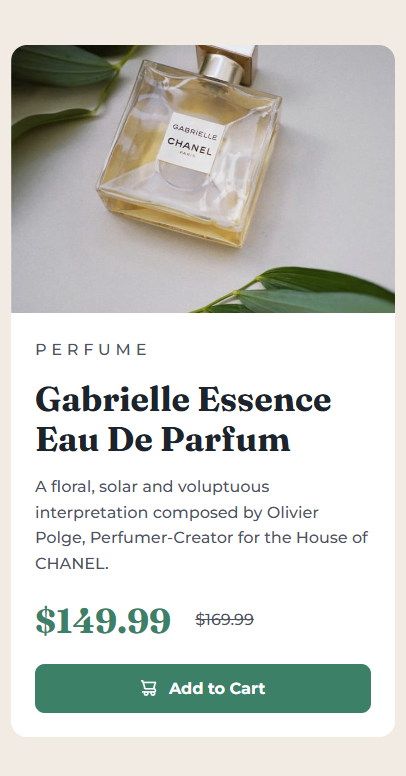

# Frontend Mentor - Product preview card component solution

This is a solution to the [Product preview card component challenge on Frontend Mentor](https://www.frontendmentor.io/challenges/product-preview-card-component-GO7UmttRfa).

## Table of contents

- [Overview](#overview)
  - [The challenge](#the-challenge)
  - [Screenshot](#screenshot)
  - [Links](#links)
- [My process](#my-process)
  - [Built with](#built-with)
  - [What I learned](#what-i-learned)
  - [Useful resources](#useful-resources)

## Overview

### The challenge

Users should be able to:

- View the optimal layout depending on their device's screen size
- See hover and focus states for interactive elements

### Screenshot

### Links

- Solution URL: [Add solution URL here](https://your-solution-url.com)
- Live Site URL: [Add live site URL here](https://your-live-site-url.com)

## My process

### Built with

- Semantic HTML5 markup
- CSS custom properties
- CSS Grid
- Flexbox
- Mobile-first workflow

I built the component with the idea that it could be used for several different product previews in a larger layout. That's why I used an `<h2>` for the product title and used an `<article>` for the card component itself.

### What I learned

- Centering content using `place-content: center;` on the `<body>`
- Changing image based on the screen width using the `<picture>` element

### Continued development

Use this section to outline areas that you want to continue focusing on in future projects. These could be concepts you're still not completely comfortable with or techniques you found useful that you want to refine and perfect.

**Note: Delete this note and the content within this section and replace with your own plans for continued development.**

### Useful resources

- [Kevin Powell: Design to Code // HTML & CSS from scratch](https://youtu.be/Z0duh-0xJ2Y?si=LIRx5Agp591_bG58) - This amazing video helped me to understand how the `<picture>` element works and how to achieve the general layout of the card using CSS grid. I've also been using his naming style for my CSS variables and it has been working great for me.
